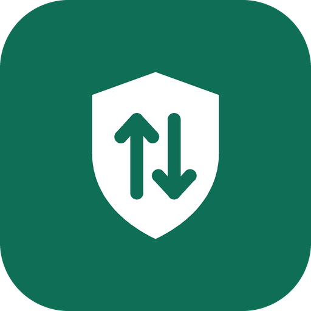

  

<h1 align="center">BackupPC VPN</h1>

  Clients for <code>xray-backuppc</code> servers: a VPN that looks like backup traffic.

  <a href="https://github.com/Mirocow/Xray-BackupPC-Clent/releases">Releases</a> ·
  <a href="./docs/app/README.md">User guide</a> ·
  <a href="https://github.com/Mirocow/Xray-BackupPC-Clent/issues">Issues</a>

  English · <a href="./readme/README.ru.md">Русский</a>

BackupPC VPN connects to servers running **xray-backuppc**. Traffic uses the `backuppc` protocol: VLESS over gRPC/HTTP2 + TLS, shaped to look like a stream of periodic BackupPC backups (random padding, a backup-like schedule, protection against active probing).

**Bring your own server.** The project does not provide VPN access. You need a `backuppc://` link from the administrator of an xray-backuppc server.

BackupPC VPN is a modified version of [OneXray](https://github.com/OneXray/OneXray), distributed under the same [GPL-3.0](./LICENSE) license.

## Clients

| Client | Platform | Package | Docs |
| --- | --- | --- | --- |
| **BackupPC VPN** app | Android 10+, arm64-v8a | APK | [User guide](./docs/app/README.md) |
| `backuppc-client` (headless) | Ubuntu / Debian, x86_64 | DEB | [deploy/linux](./deploy/linux/README.md) |
| `backuppc-socks` for podkop | OpenWrt 24.10 (aarch64, mipsel, arm, x86_64) | IPK | [openwrt](./openwrt/README.md) |

Builds are attached to [releases](https://github.com/Mirocow/Xray-BackupPC-Clent/releases). The app's code base still contains the upstream iOS, macOS and Windows targets, but only Android is built and tested for BackupPC VPN so far.

## Android app

- **Import** a `backuppc://` link, a subscription, or ordinary `vless://`, `vmess://`, `trojan://`, `ss://` links: **Servers → Add servers → Import links**, or scan a QR code.
- **Connect** to one server or let the app pick automatically; the system VPN (TUN) carries all device traffic. A quick-settings tile toggles the tunnel.
- **Routing**: Smart Routing (local network and directly reachable sites bypass the VPN), All via VPN, your own ordered rules, or a complete Xray configuration in Expert mode. See [routing](./docs/app/routing.md).
- **Per-app VPN**: all apps, only selected apps, or all except selected (**Advanced → VPN Tunnel**).
- **Share** servers and settings as `backuppcvpn://app/...` links.
- Green light and dark themes; English, Russian, Simplified and Traditional Chinese, Persian.

The `backuppc` outbound runs inside the app's Xray core; DNS through the server goes over TCP because the protocol does not carry UDP.

### Installing the APK

Download `backuppc-vpn-<version>-arm64.apk` from the releases and allow installation from your browser or file manager. Release builds are signed with the project key; an earlier build with a different signature must be uninstalled first.

## Linux and OpenWrt

- **Linux** — `backuppc-client` runs as a systemd service: a local SOCKS5 proxy, or a TUN mode that routes the whole host, with a server mode that keeps incoming connections to the host's public services working. See [deploy/linux](./deploy/linux/README.md).
- **OpenWrt** — `backuppc-socks` (≈6 MB, no Xray core) runs one SOCKS5 port per server; [podkop](https://github.com/itdoginfo/podkop) decides which domains and subnets go where, with URLTest/Selector for several servers. See [openwrt](./openwrt/README.md).in

## Privacy

No account, advertising, analytics, telemetry or crash reporting. Servers, subscriptions and settings stay on the device. See the [privacy notes](./docs/app/privacy.md) for every network request the app makes.

Shared configurations and subscription URLs contain credentials — review them before sharing.

## Building

| Target | Command |
| --- | --- |
| Android APK | `flutter build apk --release --split-per-abi --target-platform android-arm64` (first build the core with `python3 build/main.py android` in [third_party/libXray](./third_party/libXray/README.md) and copy `libXray.aar` to `android/app/libs/`) |
| Linux DEB | `make deb` |
| OpenWrt IPK | `make ipk ARCH=aarch64_cortex-a53` |

- [Development setup](./readme/FIRST_RUN.md) and [build scripts](./build_scripts/README.md).
- [backuppc protocol](./docs/backuppc-protocol.md) (Russian) and the [Go core](./core/README.md).

Release builds are signed when `android/keystore/keystore.properties` is present (gitignored); otherwise the debug key is used.

## Contributing

[Report a bug or request a feature](https://github.com/Mirocow/Xray-BackupPC-Clent/issues/new). Include the platform, app and Xray-core versions (**Settings → About BackupPC VPN**) and steps to reproduce; never publish server links or credentials.

## Credits and license

Based on [OneXray](https://github.com/OneXray/OneXray), [Xray-core](https://github.com/XTLS/Xray-core) and [libXray](https://github.com/XTLS/libXray); routing data from [v2fly](https://github.com/v2fly). Full list: [credits](./docs/app/credits.md).

[GNU General Public License v3.0](./LICENSE). Upstream copyright notices are preserved.
